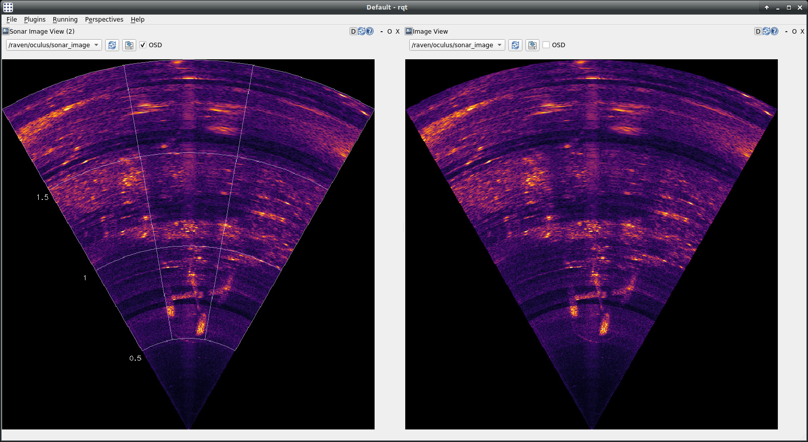

# rqt_sonar_image_view

RQT pluging for rendering [SonarImage](https://github.com/apl-ocean-engineering/hydrographic_msgs/blob/main/acoustic_msgs/msg/SonarImage.msg) messages.

Forked from [rqt_image_view](https://github.com/ros-visualization/rqt_image_view) and uses rendering functions in [sonar_image_proc](https://github.com/apl-ocean-engineering/sonar_image_proc) contains code to postprocess sonar data, including drawing the sonar data to an OpenCV Mat (contains both ROS and non-ROS code).

# Related Packages

* [sonar_image_proc](https://github.com/apl-ocean-engineering/sonar_image_proc) contains code to postprocess sonar data, including drawing the sonar data to an OpenCV Mat (contains both ROS and non-ROS code).   
* [liboculus](https://github.com/apl-ocean-engineering/liboculus) contains a (non-ROS) library which parses the Oculus network protocol and handles sonar network IO.
* [oculus_sonar_driver](https://gitlab.com/apl-ocean-engineering/oculus_sonar_driver) provides a ROS node for interfacing with the Oculus sonar.
* [acoustic_msgs](https://github.com/apl-ocean-engineering/hydrographic_msgs/tree/main/acoustic_msgs) defines the ROS [SonarImage](https://github.com/apl-ocean-engineering/hydrographic_msgs/blob/main/acoustic_msgs/msg/SonarImage.msg) message type published by [oculus_sonar_driver](https://gitlab.com/apl-ocean-engineering/oculus_sonar_driver).

# License

This repo maintains the BSD license used by [rqt_image_view](https://github.com/ros-visualization/rqt_image_view)
